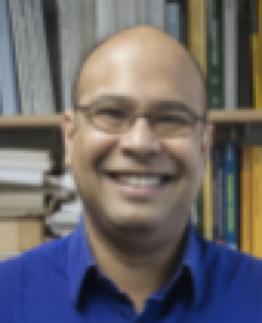
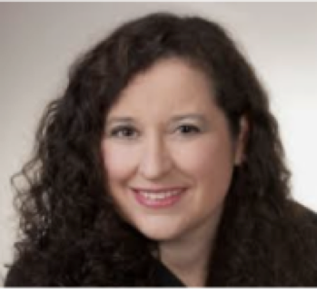
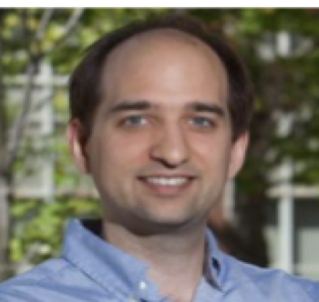
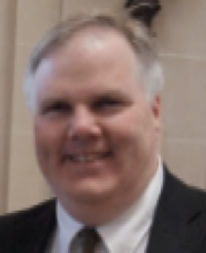

## Meet our collaborative research team:

*  [Olivier Paulius, New York University](https://math.nyu.edu/~pauluis/Olivier_Pauluis_Homepage/About_Me.html)
*  [Ansu Chatterjee, University of Minnesota](http://users.stat.umn.edu/~chatt019/index.html)
*  [Debra Laefer, New York University](https://engineering.nyu.edu/faculty/debra-laefer)
*  [Michael Lawler, Binghamton University and Cornell University](https://www.binghamton.edu/physics/faculty/profile.html?id=mlawler)
*  [Kevin McIlhany, United States Naval Academy](https://www.usna.edu/Users/physics/mcilhany/index.php)
*  [Dallas Trinkle, University of Illinois, Urbana-Champaign](https://dtrinkle.matse.illinois.edu/dokuwiki/doku.php)
